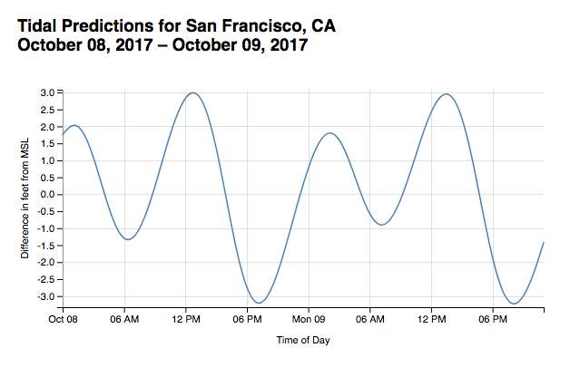

# 06-async-line-area-chart
Creating line &amp; area charts with D3 using data from a RESTful API

Using the NOAA CO-OPS data API we'll request tide prediction data for a station in the San Francisco Bay.

1. Find a station with tide predictions here: https://tidesandcurrents.noaa.gov

2. Get the id of a NOAA station with tide predictions, using [this interactive map](https://tidesandcurrents.noaa.gov/map/index.shtml?region=California). Make sure to choose "Tide Predictions" in the dropdown for "Require Type".
such as [this one for San Francisco](https://tidesandcurrents.noaa.gov/noaatidepredictions.html?id=9414290).
It should be a sequence of numbers such as `9414782`.

3. Take a look at the documentation for the [NOAAA CO-OPS API](https://tidesandcurrents.noaa.gov/api/). Note the following are expected in the request:
  - Station ID: a 7 character station ID, or a currents station ID.
  - Date & Time. There are various ways to specify the temporal range of our data. Notice the options for formatting the date and/or time: `yyyyMMdd`, `yyyyMMdd HH:mm`, `MM/dd/yyyy`, or `MM/dd/yyyy HH:mm`
  - Product: the type of data we want. We're interested in "predictions".
  - Datum: "a standard elevation defined by a certain phase of the tide", [read more about tidal datums here](https://tidesandcurrents.noaa.gov/datum_options.html). We'll specify MSL for "Mean Sea Level".
  - Units: metric or english
  - Time Zone: we are interested in LST / "Local Standard Time"
  - Format: XML or JSON, we want JSON because it's more JS friendly.

4. The base URL for the API is `https://tidesandcurrents.noaa.gov/api/datagetter`, we'll tack on our options as query parameters when making the actual GET request.

**Resources:**

- [d3-request](https://github.com/d3/d3-request)
- [d3-time-format](https://github.com/d3/d3-time-format/blob/master/README.md)
- [d3-shape](https://github.com/d3/d3-shape/blob/master/README.md#lines)
